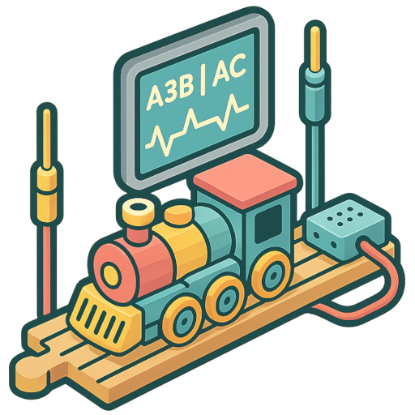

# eTrain3D

  

Kennst Du die Eisenbahn und das Schienensystem, meist aus Holz von den Firmen Brio, Eichhorn, IKEA Lillabo, HABA etc.?

---

## Inhalt

- [eTrain3D](#etrain3d)
  - [Inhalt](#inhalt)
  - [Aktuelle Informationen](#aktuelle-informationen)
  - [Submodule](#submodule)
  - [Lizenz](#lizenz)

---

## Aktuelle Informationen

---

## Submodule

- [x] [Schienensystem](https://local.ionivation.com/eTrain3D/rail-cad-standart)  
- [ ] Fahrzeuge  
- [x] [Wiki](https://local.ionivation.com/eTrain3D/eTrain3D/wiki/)  
- [ ] Controller und Firmware  

## Lizenz

  

Diese Dateien unterliegen einer individuellen Lizenzvereinbarung (DE/EN):  
📄 [LICENSE](./LICENSE)  

- Keine Weiterverbreitung der Originaldateien erlaubt  
- Kommerzielle Nutzung der Modelle nur zur Eigenproduktion gestattet  
- Änderungen für Eigengebrauch erlaubt  

> **(C) 2025 - Adam Skotarczak**  
